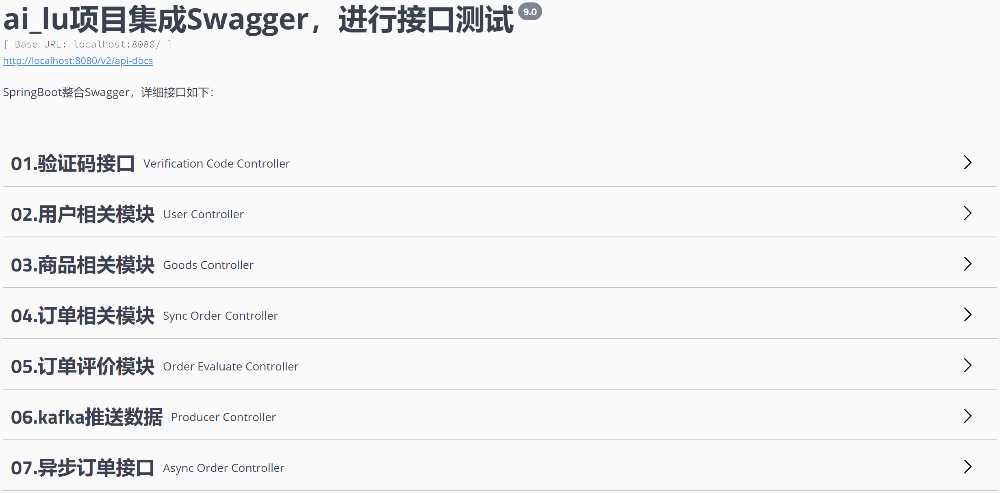
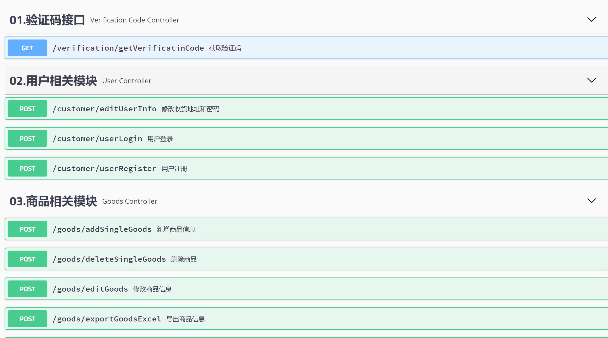
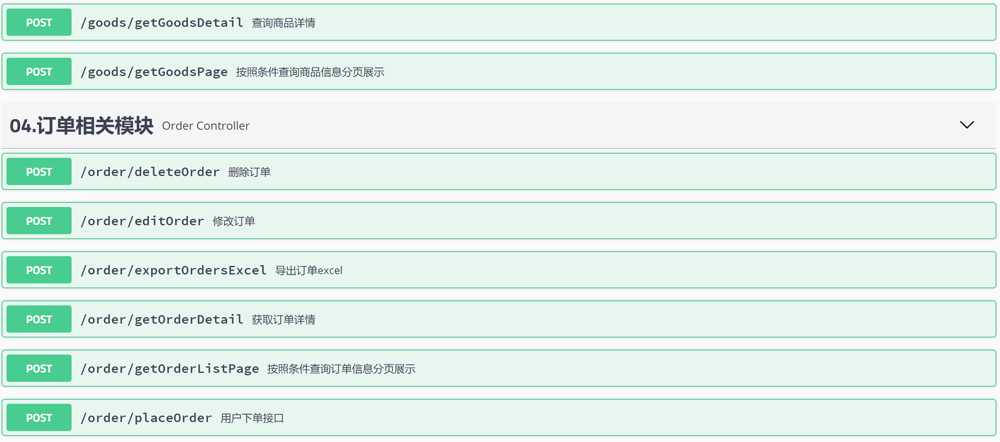
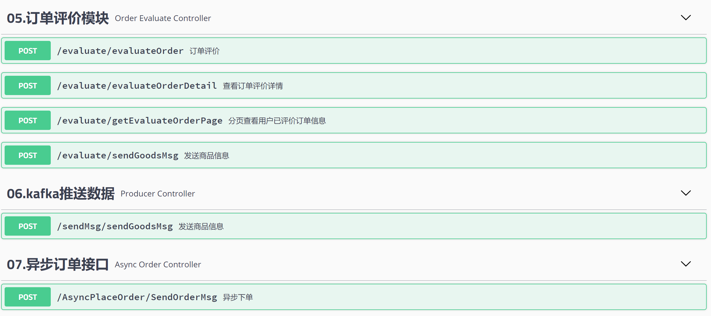

# ai_lu

#### 介绍
   技术栈介绍：基于springboot+mybatis+mysql的web项目，缓存中间件选用了redis,采用的是哨兵的模式，实现了高可用，消息中间件是kafka,同时集成了swagger方便接口的测试，项目中有分布式锁的应用场景，以及基于redisson的解决方案，欢迎大家提出建议和修改，我将持续迭代进行开发，如果觉得还不错的话给个star,万分感谢！

#### 操作介绍

1.  搭建redis的哨兵模式
2.  搭建kafka环境
3.  搭建mysql数据库，其它运行环境自己搭建这里不细说，如jdk、maven等
4.  修改application.properties里的相关配置文件
5.  将项目在容器中部署，启动
6.  页面登录swagger,swagger地址：http://localhost:8080/swagger-ui.html
7.  接下来就可以通过swagger对接口进行测试

#### 后台接口展示

#### 参与贡献

1.  Fork 本仓库
2.  新建 ailu_xxx 分支
3.  提交代码
4.  新建 Pull Request

#### 特技

1.  使用 Readme\_XXX.md 来支持不同的语言，例如 Readme\_en.md, Readme\_zh.md
2.  Gitee 官方博客 [blog.gitee.com](https://blog.gitee.com)
3.  你可以 [https://gitee.com/explore](https://gitee.com/explore) 这个地址来了解 Gitee 上的优秀开源项目
4.  [GVP](https://gitee.com/gvp) 全称是 Gitee 最有价值开源项目，是综合评定出的优秀开源项目
5.  Gitee 官方提供的使用手册 [https://gitee.com/help](https://gitee.com/help)
6.  Gitee 封面人物是一档用来展示 Gitee 会员风采的栏目 [https://gitee.com/gitee-stars/](https://gitee.com/gitee-stars/)
